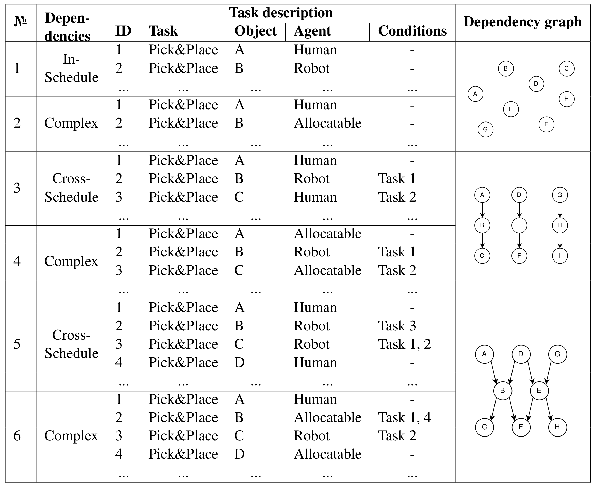

# Scheduling and reactive control in HRC

The code presented in this repository is designed for scheduling tasks between a human and a robot and adapting it in case of changes triggered by uncertainties. 

Relevant publication (in submission):

**CoBOS: Constraint-Based Online Scheduler for Human-Robot Collaboration**
by Marina Ionova and [Jan Kristof Behrens](www.behrens-jan.de).


## About scheduling 
Scheduling is an integer constraint programming problem that is solved by using [Google Optimization Tools][about-ortool]

[about-ortool]: https://github.com/google/or-tools

Here you can see the animation of the simulation with and without perfect knowledge. #TODO: add links to gif on github

## Installation 

Create conda environment:
```
conda create -n msched python=3.10
conda activate msched
pip install -e .
```
## Installation for the package development

Clone the repository, install [pdm](https://pdm-project.org/latest/) (if you haven't done so before) go to the repository root folder and install it via:

`pdm install`

Before pushing your commits, you can check the code formating with `pdm lint` and tests with `pdm test`.

### Run experiments

To run all experiments prsented in the paper, run the following script (it will run for a few hours)
```
python src/exp_scripts/run_base_scheduling_exps.py
```
or just download our files:
```
sudo apt update
pip3 install gdown
gdown https://drive.google.com/uc?id=1dQ6fqjqmdjptIeFad1utaPkyIB6cPHCj -O sched_exps.zip
unzip sched_exps.zip -d ~/sched_exps
```

Plot barplot (It is necessary to clarify the path if you have saved the results of the experiments to another location. Default path is `~/sched_exps/base_sched`):
```
python main_plot.py
```
options:
*  -h, --help   Show help message and exit
*  --path PATH  Path to the experiments result 
*  --case CASE  Add case number (default case is 8)

### Run simulation
Run offline simulation:
```
python main.py [case]
```
The schedule will be saved in a json file and as an image.
positional arguments: <br />
*  case - 1, 2, 3, 4, 5, 6
options:
*  -h, --help            show help message and exit
*  --only_schedule, --no-only_schedule - show only initial schedule
*  --save_gt, --no-save_gt - save simulation Gant Chart to file
*  --save2file, --no-save2file - save simulation result to file
*  --offline_video, --no-offline_video - make video from the simulation


## Quick Start
You can choose one of these cases:



[//]: # (### Replay graph offline)

[//]: # (After running simulation, you can view the Gantt Chart of initial and final schedule.)

[//]: # (```)

[//]: # ( python main_plot.py )

[//]: # (```)

[//]: # (positional arguments:<br />)

[//]: # (mode - Select the mode you want to render: sim_vis or plot_schedule)

[//]: # ()
[//]: # (options: <br />)

[//]: # (*-h, --help* show this help message and exit)
## Change settings

`inputs/config.py`

* allocation_weights - for case 4-6 you can choose task ration (% of human's task, % of robot's task, % of allocatable tasks)
* n - number of mode in a distribution of phase duration 
* mean_min (mean_max) - boundaries for a distribution mean value of phase duration  
* deviation_min (deviation_max) - boundaries for a distribution deviation value of phase duration

[//]: # (* ## Plot comparison)

[//]: # ()
[//]: # (In `main.py` change seeds, then run)

[//]: # (```)

[//]: # (python main.py [case] --comparison)

[//]: # (python main_plot.py comparison)

[//]: # (```)
